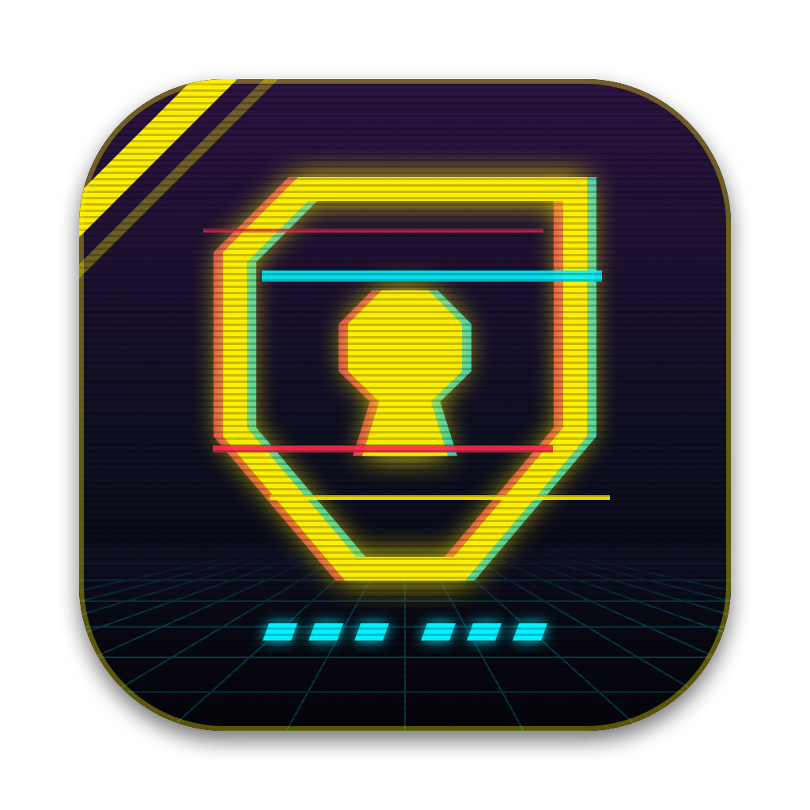
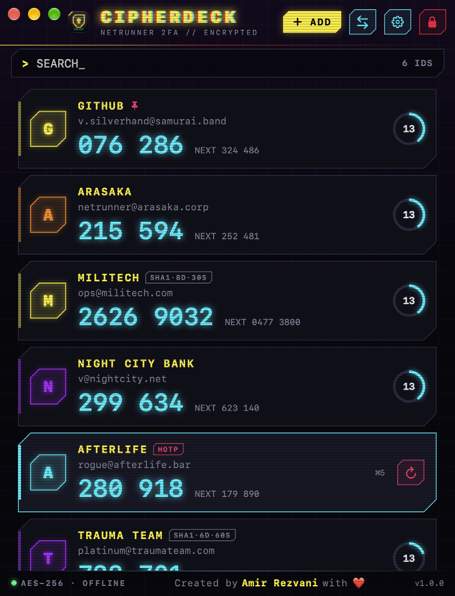
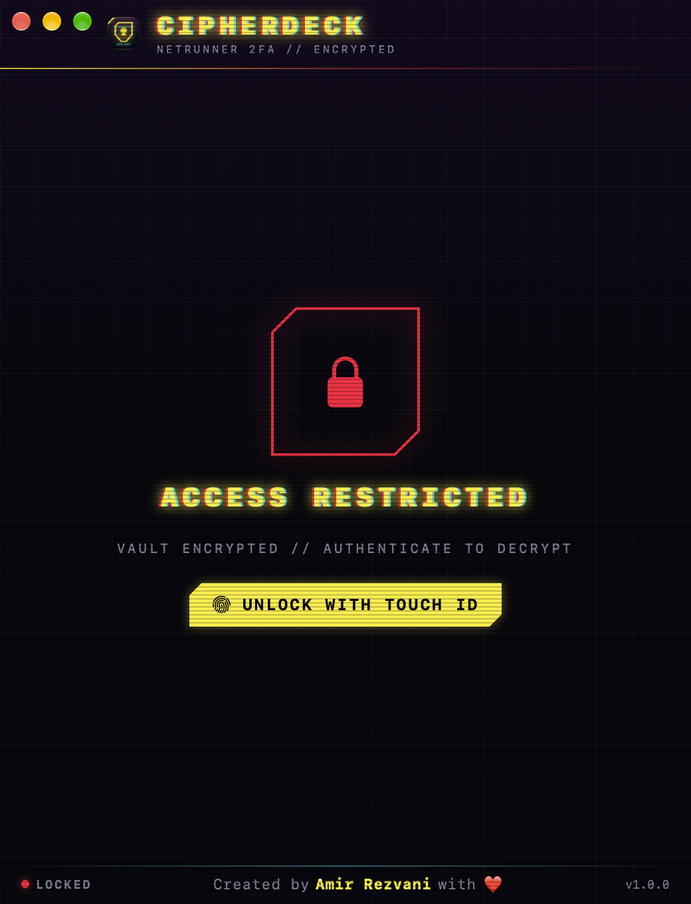
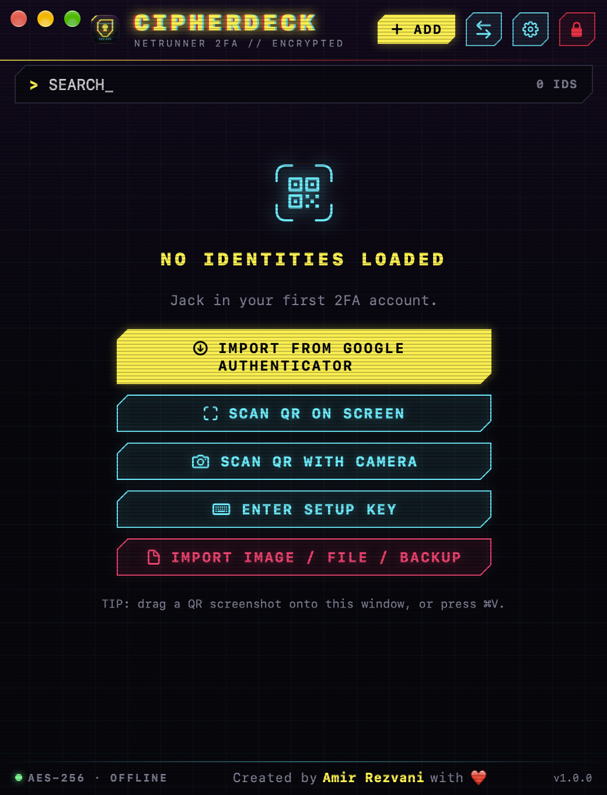
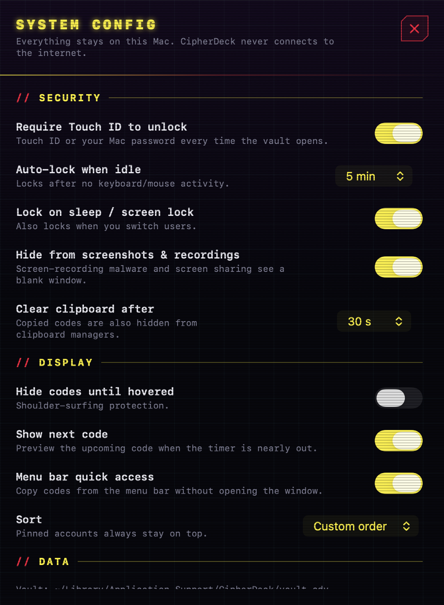
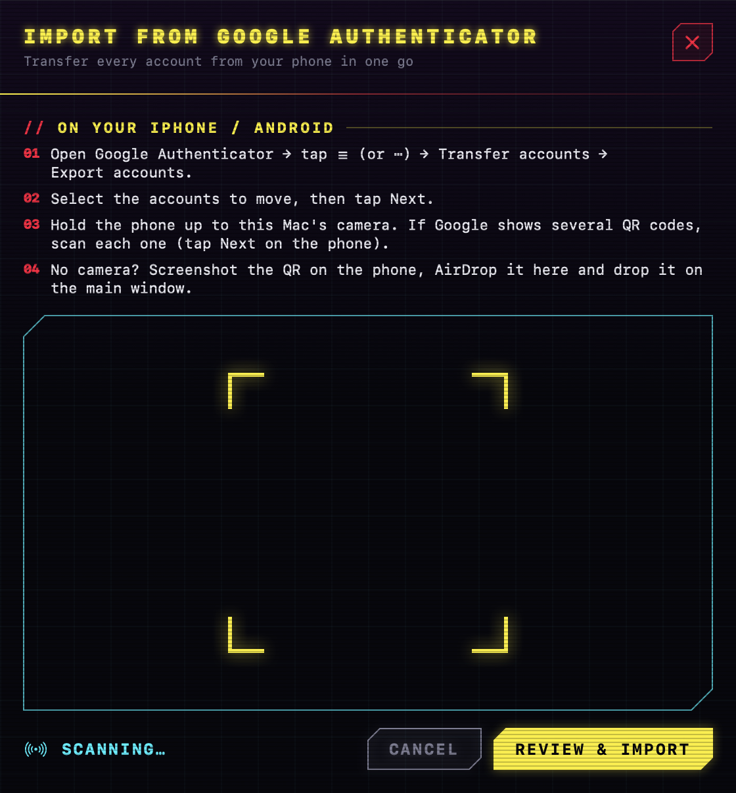
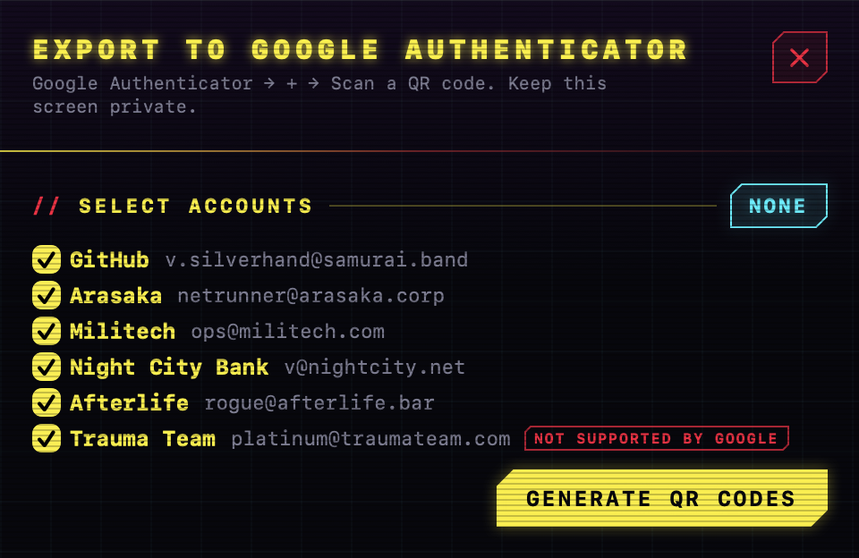
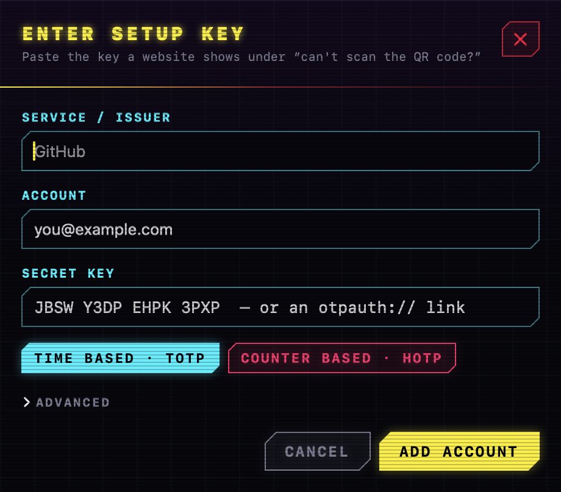

<p align="center">
  
</p>

<h1 align="center">CipherDeck</h1>

<p align="center">
  <b>A native macOS authenticator with a Cyberpunk 2077 look.</b><br>
  TOTP/HOTP 2FA codes on your Mac · import from Google Authenticator · encrypted · offline · open source
</p>

<p align="center">
  
  
  
  
  
</p>

<p align="center">
  
</p>

Google Authenticator has no Mac app. CipherDeck fills that gap. It can do everything the
iPhone app does, plus several things it can't, and your secrets never leave your Mac.

## Features

| | Google Authenticator (iPhone) | CipherDeck |
|---|:---:|:---:|
| TOTP & HOTP codes, SHA-1/256/512, 6–8 digits | ✅ | ✅ |
| Tap/click a code to copy | ✅ | ✅ |
| Add by QR code or setup key | ✅ | ✅ camera, screen region, image, clipboard, drag & drop |
| Import from Google Authenticator (Transfer accounts) | ✅ | ✅ multi-QR batches, de-duplicated |
| Export to Google Authenticator | ✅ | ✅ |
| Search, rename, delete, reorder | ✅ | ✅ |
| Privacy screen / biometric lock | ✅ | ✅ Touch ID or Mac password, auto-lock on idle/sleep/screen lock |
| Encrypted backup file you control | — | ✅ AES-256-GCM + PBKDF2 (600k) |
| Next-code preview | — | ✅ |
| Pin favourites, sort modes, encrypted notes | — | ✅ |
| Menu bar quick access | — | ✅ |
| Clipboard auto-clear, hidden from clipboard managers | — | ✅ |
| Hidden from screenshots & screen recording | — | ✅ |
| Hide codes until hovered | — | ✅ |
| Keyboard driven (⌘F, Return, ⌘1…⌘9, ⌘L) | — | ✅ |
| Works fully offline, no account, no cloud | — | ✅ |

## Screenshots

| Locked | First launch | Settings |
|---|---|---|
|  |  |  |

| Import from Google | Export to Google | Enter setup key |
|---|---|---|
|  |  |  |

The screenshots use CipherDeck's demo mode (`--demo`), so every account and code in them is fake.

## Install

1. Download `CipherDeck-<version>.dmg` from [Releases](https://github.com/Amirzvni/CipherDeck/releases), or [build it yourself](#build-from-source).
2. Open the DMG and drag **CipherDeck** into **Applications**.
3. CipherDeck is ad-hoc signed rather than notarized (the project doesn't use a paid Apple
   Developer account), so the first launch goes through Gatekeeper:
   - Open CipherDeck. When macOS blocks it, go to **System Settings → Privacy & Security** and click **Open Anyway**.
   - Or, from Terminal: `xattr -dr com.apple.quarantine /Applications/CipherDeck.app`
4. On first launch macOS asks for permission to store CipherDeck's key in your Keychain.
   Choose **Always Allow**. You'll see this prompt once more after each update, because
   every build has a new signature.

You can verify the download with the `.sha256` file published next to the DMG:
`shasum -a 256 CipherDeck-*.dmg`.

## Move your accounts from Google Authenticator

1. On your phone, open Google Authenticator, tap **☰ / ⋯**, then **Transfer accounts → Export accounts**.
2. Select the accounts you want to move and tap **Next**.
3. In CipherDeck, click **⇄ → Import from Google Authenticator…** and hold the phone up to
   your Mac's camera. If Google shows several QR codes, scan each one. CipherDeck tracks
   which batches it has already scanned.
4. Review the accounts and click **Import**.

No camera? Take a screenshot of the QR code on the phone, AirDrop it to your Mac, and drag it
onto the CipherDeck window.

> Keep the accounts on your phone as well until you've confirmed the codes on your Mac work.
> Then make an encrypted backup: **⇄ → Export Encrypted Backup…**

## Security model

Security and reliability are the project's two pillars (see [CLAUDE.md](CLAUDE.md)).

- **Encrypted at rest.** Accounts are stored in `~/Library/Application Support/CipherDeck/vault.cdv`,
  encrypted with AES-256-GCM (CryptoKit). The random 256-bit key lives in your login Keychain.
  The Keychain item's access list is tied to CipherDeck's code signature, so if any other
  app tries to read it, macOS shows you a prompt.
- **Locked means wiped.** When the vault locks, the decrypted accounts and the key are
  dropped from memory. Unlocking requires Touch ID or your Mac password.
- **No network, no dependencies.** CipherDeck contains no networking code, no analytics, no
  update checker and no third-party packages. It uses Apple frameworks only.
- **Hardened Runtime.** This blocks code injection and debugger attachment. The only
  entitlement is the camera, which is used for QR scanning.
- **Screen-capture protection.** Windows are excluded from screenshots, screen recordings
  and screen sharing. You can turn this off in Settings.
- **Clipboard hygiene.** Copied codes are marked `ConcealedType`/`TransientType`, so clipboard
  managers skip them. They're cleared automatically after 30 seconds (configurable), but only
  if the clipboard still holds the code.
- **Sensitive actions need authentication.** Revealing a setup key, showing export QR codes
  and turning off the lock all ask for Touch ID or your password.
- **Hostile input is expected.** The Google migration decoder is bounds-checked and fuzzed
  with 20,000 random payloads in the self-test suite.
- **Hard to lose data.** Writes are atomic and verified by reading them back. The previous
  good vault is kept as `vault.cdv.bak` and used automatically if the main file is damaged.
  If the key goes missing, CipherDeck will never overwrite a vault it can't read.

**What this protects against:** stolen or copied disks and backups, other apps quietly reading
the vault file, screen-recording malware, clipboard snooping, and people looking at your
unlocked Mac.

**What it can't protect against:** malware that already runs as your user can try to trick you
into clicking "Always Allow" on the Keychain prompt, or can keylog your password. Only allow
Keychain access when you are the one who just launched CipherDeck.

## Build from source

Requirements: macOS 14+ with the Xcode Command Line Tools (`xcode-select --install`). Full
Xcode isn't needed, and neither is an Apple Developer account.

```bash
git clone https://github.com/Amirzvni/CipherDeck.git
cd CipherDeck
swift run CipherDeckSelfTest     # 613 checks: RFC 4226/6238 vectors, Google import, vault, backups
./scripts/make_dmg.sh            # → dist/CipherDeck.app and dist/CipherDeck-<version>.dmg
```

If Xcode is installed but its license hasn't been accepted, prefix commands with
`DEVELOPER_DIR=/Library/Developer/CommandLineTools` (the scripts already do this).

Other scripts:
- `./scripts/build_app.sh` builds and signs the `.app` only.
- `./scripts/build_icon.sh` regenerates the logo from `scripts/generate_icon.swift`.
- `dist/CipherDeck.app/Contents/MacOS/CipherDeck --demo` runs with fake accounts. It never
  touches the Keychain or disk.

### Project layout

```
Sources/CipherDeckCore      pure logic: Base32, HOTP/TOTP, otpauth://, Google migration protobuf,
                            encrypted vault, encrypted backups, import/merge
Sources/CipherDeck          SwiftUI app: theme, views, Keychain, lock, clipboard, QR scanning
Sources/CipherDeckSelfTest  executable test suite
scripts/                    icon, app bundle and DMG builders
STATE.md                    roadmap & development progress
```

## Contributing

Issues and PRs are welcome. Please read [CLAUDE.md](CLAUDE.md) first. The security and
reliability rules there aren't optional: no networking, no dependencies, and
`swift run CipherDeckSelfTest` must pass.

## License

[MIT](LICENSE) © 2026 Amir Rezvani

CipherDeck is a fan-styled, independent project. It isn't affiliated with or endorsed by
Google or CD PROJEKT RED. "Google Authenticator" and "Cyberpunk 2077" are trademarks of
their respective owners.

<p align="center"><br>Created by <b>Amir Rezvani</b> with ❤️</p>
